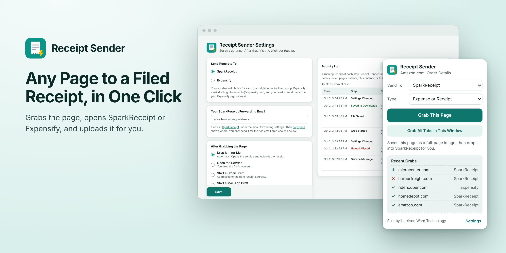
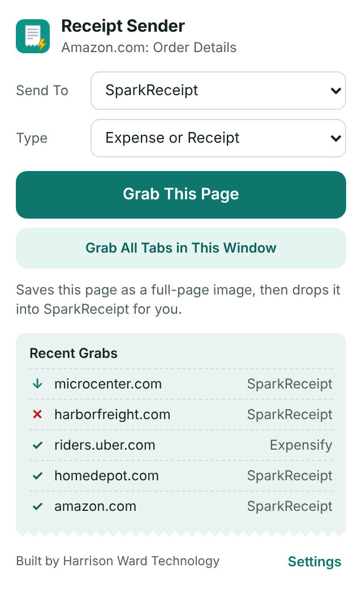
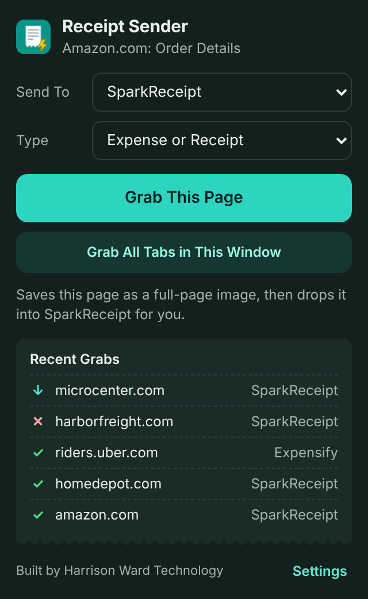
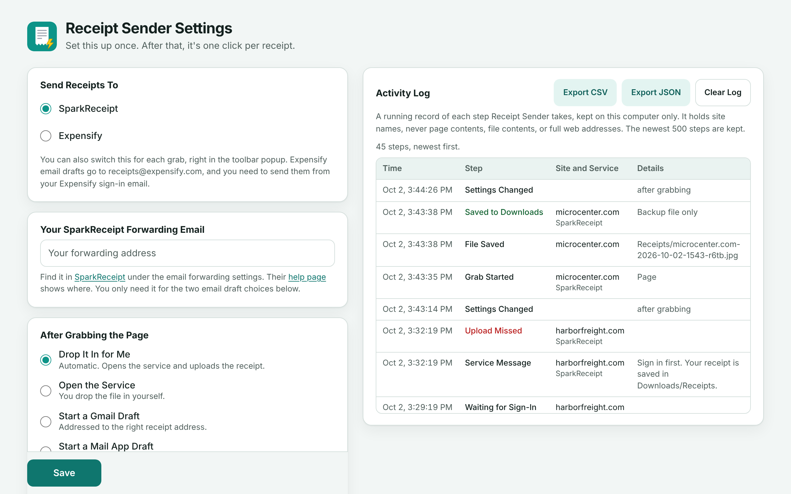
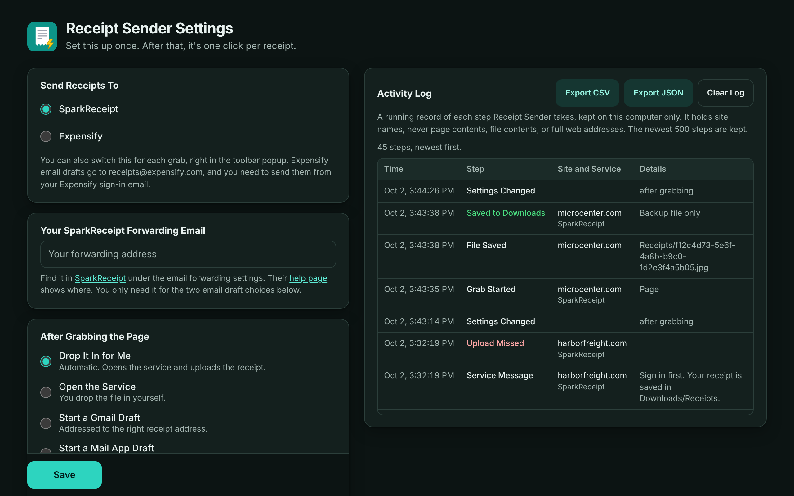
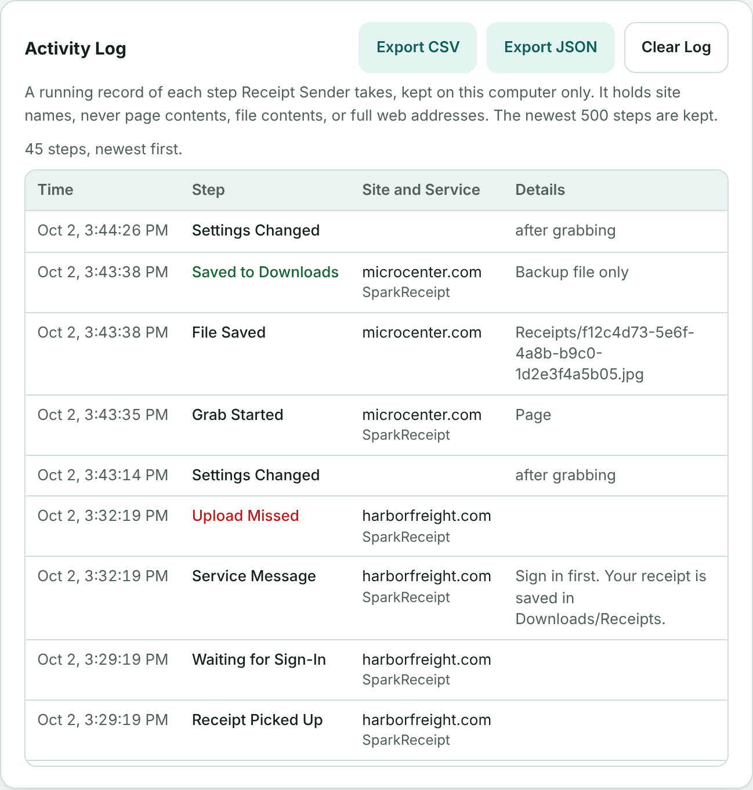
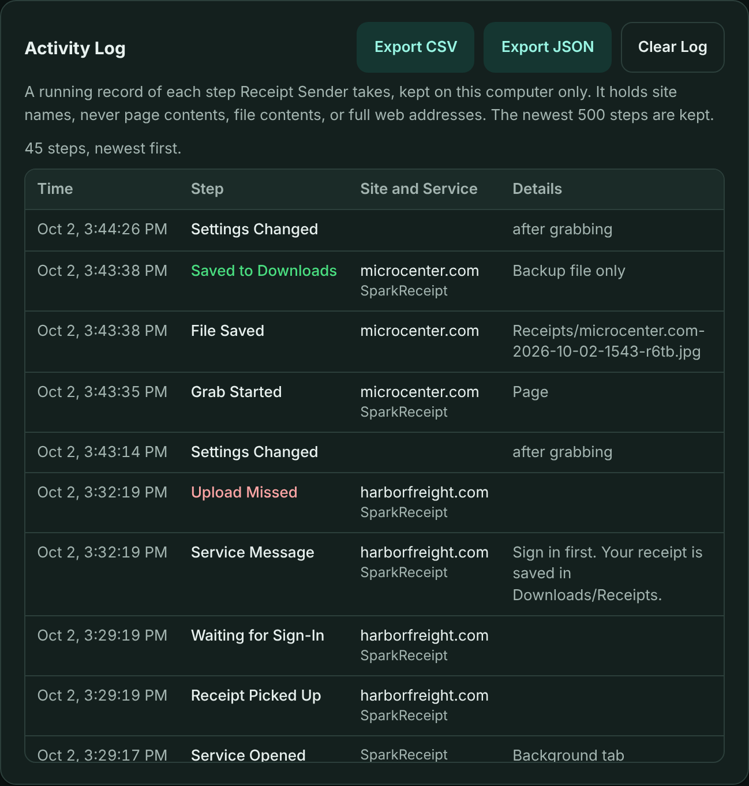
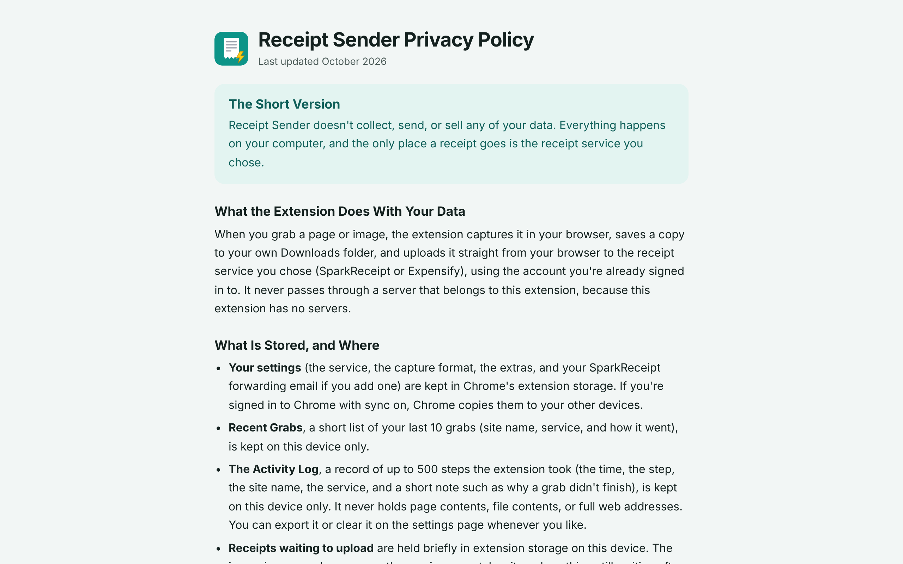
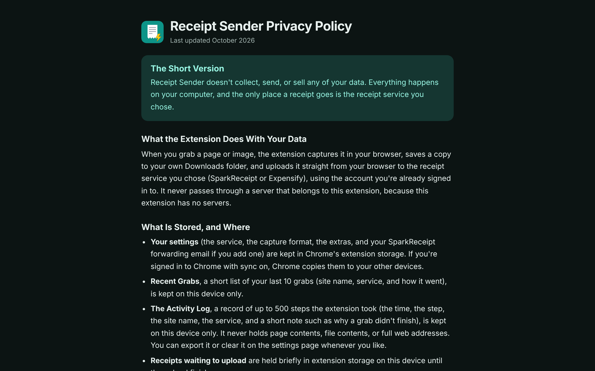

# Receipt Sender

   [](https://github.com/HarrisonWard/Spark-Receipt-Sender/actions/workflows/test.yml)

<picture>
  <source media="(prefers-color-scheme: dark)" srcset="docs/screenshots/hero-dark.png">
  
</picture>

A Chrome extension that turns any web page or image into a receipt inside [SparkReceipt](https://sparkreceipt.com) or [Expensify](https://expensify.com) with one click. No dragging, no forwarding, no babysitting. Pick the service in the popup, click the button, done.

Built because SparkReceipt has no browser extension and Expensify retired theirs. This fills both gaps.

## What It Does

One click on a receipt page and the extension grabs the whole page as a stitched full-page image, opens your receipt service, walks its own upload screens, and the scan starts.

- **SparkReceipt:** Add documents, Expense or receipt, attach, Confirm.
- **Expensify:** Scan receipt, drop on the upload zone, Create expense.

A small note in the corner of the service page tells you each step as it happens. A backup copy of every grab lands in Downloads/Receipts.

## Screenshots

| Light | Dark |
|---|---|
|  |  |
| The popup: pick a service, grab the page, see your recent grabs. | Dark mode follows your device setting. |
|  |  |
| Settings on the left, the Activity Log on the right. | The same page in dark mode. |
|  |  |
| The Activity Log: every step of every grab, kept on your computer. | Export it as CSV or JSON, or clear it. |
|  |  |
| The privacy policy that ships with the extension. | The same page in dark mode. |

More in [docs/screenshots](docs/screenshots): the popup and settings page before your first grab, and the settings page on a narrow window.

## Features

| Feature | How |
|---|---|
| Grab a Whole Page | Stitched full-page image, from the toolbar, a right-click, or Alt+Shift+S |
| Grab Just an Image | Right-click any image and send only that |
| Grab All Tabs | One click sends every tab in the window through the queue |
| Two Services | SparkReceipt and Expensify, switchable for each grab in the popup |
| Auto Drop | Walks each service's real upload screens and confirms for you |
| Silent Mode | Runs in a background tab so you never leave your page |
| Auto Close the Tab | Optional, waits for the upload to finish first |
| Auto Delete the Backup File | Optional, only after a fully successful drop |
| Recent Grabs | Your last 10 grabs in the popup, each marked uploaded, saved, or missed |
| Activity Log | A timestamped record of every step, kept on your computer, with export and clear |
| Type Picker | SparkReceipt grabs can be filed as an expense, invoice, statement, or other document |
| Unique File Names | Every grab saves under a unique ID, so names never collide |
| Safety Net | Any miss leaves the tab open and the file in Downloads/Receipts |
| Light and Dark Mode | The popup, settings, and privacy pages follow your device setting |

## Install

1. Download this repo (green Code button, Download ZIP) and unzip it somewhere permanent.
2. Open chrome://extensions in Chrome.
3. Turn on Developer mode (top right).
4. Click Load unpacked and pick the folder.
5. Pin the icon: click the puzzle piece in the toolbar, then the pin.

The settings page opens when you install. Add your SparkReceipt forwarding email there only if you want the email draft choices. The automatic drop needs no setup at all.

## Use It

- Click the toolbar icon, then **Grab This Page**.
- Or right-click a page and choose **Send Page to SparkReceipt** (or Expensify, the menu follows your setting).
- Or right-click an image and choose **Send This Image to SparkReceipt**.
- Or press **Alt+Shift+S**.

Watch the toolbar badge: OK means the upload landed, ! means take a look at the tab (the Activity Log on the settings page says what happened). After Grab All Tabs, OK means every tab was grabbed, and ! means at least one wasn't.

## Settings

Click **Settings** in the popup, or right-click the toolbar icon and choose Options.

- **Send Receipts To:** SparkReceipt or Expensify. You can also switch this right in the popup.
- **After Grabbing the Page:** automatic drop (the default), open the service so you can drop the file in yourself, a Gmail draft, a draft in your mail app, or just save the file.
- **Save the Page As:** a stitched full-page image (the default) or a quick screenshot of what's on screen.
- **Extras:** open the folder after saving, close the service tab when the upload finishes, delete the backup file when the upload finishes, and Silent Mode. All off by default.

## Activity Log

The settings page keeps a running record of what the extension did: grab started, file saved, service opened, upload confirmed or missed (with the reason), tab closed, backup deleted, and settings changed.

- It lives in the extension's storage on your computer. Nothing is sent anywhere.
- It records site names only. Never page contents, file contents, page titles, or full web addresses.
- It keeps the newest 500 steps and drops the oldest.
- **Export CSV** and **Export JSON** save it as a file. **Clear Log** empties it.

## How the Auto Drop Works

Neither service has a public upload API, so the extension works each web app the way a person would.

- **SparkReceipt:** a script on app.sparkreceipt.com opens Add documents, picks the document type, hands the file to their upload field, and clicks Confirm.
- **Expensify:** a script on new.expensify.com clicks Scan receipt, drops your file onto their upload zone, and clicks Create expense.

Both flows were last verified against the live apps in August 2026. Version 4.1.0 didn't change how either flow works, and it wasn't checked against the live apps again. If either service redesigns its upload screens, the drop may miss until the extension is updated. The backup file in Downloads/Receipts always works in the meantime.

## Permissions, in Plain English

No debugger permission and no blanket site access.

- **activeTab and scripting:** capture the page you asked to grab, stitch long pages, and fetch an image you right-clicked.
- **Site access, two sites only:** app.sparkreceipt.com and new.expensify.com, where the extension drops your files in.
- **Optional access to all sites:** asked for once, only if you use Grab All Tabs (Chrome won't capture background tabs without it). Say no and everything else still works.
- **downloads:** save the backup copy to Downloads/Receipts, and delete it if you turn that extra on.
- **storage and unlimitedStorage:** remember your settings, Recent Grabs, and the Activity Log, and hold a large image while it waits to upload.
- **contextMenus:** the two right-click menu items.

## Privacy

Nothing is collected. The only thing that leaves your computer is the upload to your own SparkReceipt or Expensify account. The full policy is in [PRIVACY.md](PRIVACY.md), and the same text ships with the extension as privacy.html.

## Security

- Zero dependencies. No npm packages in the extension, no build step, no supply chain. What you read in this repo is exactly what runs.
- No remote code, no analytics, no telemetry, no servers.
- Minimal permissions by design. The one broad permission is optional and off until you use Grab All Tabs.
- Grabs can only be started from the extension's own popup, menus, and shortcut. A script on a web page can't start one.
- The Activity Log strips web addresses down to the site name before anything is written.

## Tests

The tests use Node's built-in test runner. There's nothing to install.

```
node --test test/
```

They cover the manifest and its permissions, the service worker's queue, settings, and Recent Grabs logic, the Activity Log, the order of clicks in both upload scripts (against stand-in pages), the pages' labels and local-only files, color contrast in light and dark mode, and the wording rules for this repo. They run on GitHub for every pull request that changes code.

The tests can't sign in to SparkReceipt or Expensify, so they don't prove the live sites still match. That part is checked by hand.

Three optional helpers in `tools/` need Python Playwright with Chromium:

- `python3 tools/screenshots.py` retakes every screenshot in docs/screenshots.
- `python3 tools/ui_check.py` clicks through the popup and settings page with a stand-in for Chrome's extension features.
- `python3 tools/mock_flow_check.py` loads the real extension in Chromium and runs both upload flows against local stand-in pages.

## What's New

See [CHANGELOG.md](CHANGELOG.md) for what changed in each version. The latest is 4.1.0: a refreshed look with dark mode, the Activity Log, and automated tests.

## Notes

- SparkReceipt grabs land as the document type you picked in the popup (Expense or Receipt by default). Expensify grabs land as scanned expenses.
- Expensify rejects files under 240 bytes, which never matters for real receipts.
- Gmail and mail app drafts address themselves to the right place for each service: your SparkReceipt forwarding address, or receipts@expensify.com (send from your Expensify sign-in email).
- Very long pages are captured up to 12 screens tall.
- Chrome's own pages and the Chrome Web Store can't be captured.
- Because it's loaded unpacked, Chrome may occasionally remind you about developer mode extensions. You can dismiss that.

## License

Source available for transparency and personal use. No republishing to extension stores, no redistribution. Full terms are in [LICENSE](LICENSE).

Built by Harrison Ward Technology.
